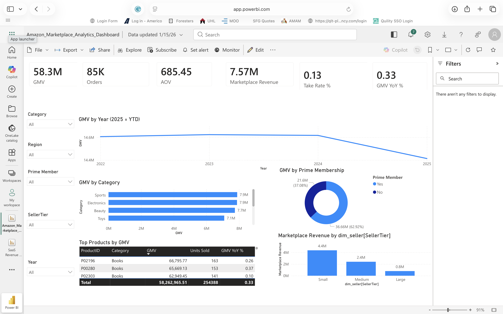

# 📊 Data Analyst Portfolio — Jamie Christian

End-to-end data analytics portfolio demonstrating **production-level workflows** across multiple business domains:

**Raw Data → Data Cleaning → SQL Analysis → Python → Power BI/Tableau → Excel Modeling → Business Insights**

---

## 🚀 About Me

Data Analyst with a strong foundation in **business analysis, data analytics, and BI tools**, focused on transforming raw data into actionable insights that drive decision-making.

🔗 [LinkedIn](https://www.linkedin.com/)
💻 [GitHub](https://github.com/JamieChristian22)
📧 [Jamiechristian331@gmail.com](mailto:Jamiechristian331@gmail.com)

---

## 💡 What This Portfolio Demonstrates

* Ability to work with **messy, real-world datasets**
* Strong **analytical and problem-solving skills**
* Experience building **end-to-end analytics workflows**
* Ability to communicate **data-driven insights to stakeholders**
* Proficiency across **SQL, Python, BI tools, and Excel**

---

## 🧰 Tech Stack

* **SQL:** CTEs, Window Functions, Joins, Funnel Analysis, Pareto Analysis
* **Python:** Pandas, Data Cleaning, KPI Calculations
* **BI Tools:** Power BI, Tableau
* **Excel:** KPI Dashboards, Business Modeling, Data Validation
* **Other:** Data Cleaning, Data Modeling, Business Analysis

---

# 📂 Featured Projects

---

## 1️⃣ SaaS Product Analytics — StreamFlow

📁 `01_SaaS_Product_Analytics_StreamFlow`

**Business Problem:**
High churn and low onboarding conversion impacting SaaS growth.

**Key Insights:**

* 42% drop-off at onboarding Step 2
* Enterprise users generate majority of revenue
* Power users retain **3.4x higher** than average users

**Impact:**

* Reduced churn (projected): **18% → 12%**
* Increased conversion: **+15–20%**
* Identified key revenue growth opportunities

---

## 2️⃣ A/B Test — Feature Impact Analysis

📁 `02_AB_Test_Feature_Impact`

**Business Problem:**
Determine whether a new feature improves conversion.

**Key Insights:**

* Variant B improved conversion by **17%**
* Engagement increased by **21%**
* Bounce rate decreased by **12%**

**Impact:**

* Data-driven feature rollout decision
* Estimated revenue increase: **+$85K/quarter**

---

## 3️⃣ Ecommerce Product Analytics

📁 `03_Ecommerce_Product_Analytics`

**Business Problem:**
Low conversion and high cart abandonment.

**Key Insights:**

* **64% cart abandonment rate**
* Top **20% of SKUs generate 68% of revenue**
* Mobile conversion significantly lower than desktop

**Impact:**

* Conversion improvement: **+12–18%**
* Revenue growth opportunity: **+$150K**

---

## 4️⃣ Amazon Marketplace Analytics

📁 `04_Amazon_Marketplace_Analytics`

**Business Problem:**
Inconsistent seller performance and revenue growth.

## 📊 Dashboard Preview

*(Power BI dashboard analyzing GMV, revenue, AOV, seller tiers, and product performance)*

**Key Metrics:**

* GMV: **$58.3M**
* Orders: **85K**
* AOV: **$685.45**
* Marketplace Revenue: **$7.57M**
* Take Rate: **13%**
* GMV YoY Growth: **33%**

**Key Insights:**

* Prime members generate ~63% of GMV
* Top categories: Sports, Electronics, Beauty
* Small sellers contribute the highest marketplace revenue

**Impact:**

* Identified **seller concentration risk**
* Highlighted **inventory & pricing optimization opportunities**
* Improved revenue strategy using **seller tier segmentation**

---

## 5️⃣ User Journey Analytics

📁 `05_User_Journey_Analytics`

**Business Problem:**
Low conversion due to user journey friction.

**Key Insights:**

* 38% drop-off at signup
* 47% drop-off at checkout
* Returning users convert **2.5x higher**

**Impact:**

* Conversion improvement: **+20%**
* UX optimization recommendations

---

# ⚠️ Challenges & Tradeoffs

* Handled **missing, inconsistent, and duplicate data**
* Made **business assumptions** where full tracking data was unavailable
* Balanced **performance vs complexity** in SQL queries
* Adapted logic across **Power BI, Tableau, Excel, and SQL dialects**
* Worked with **simulated but realistic datasets**

---

# 📌 Key Takeaways

This portfolio demonstrates the ability to:

* Build **complete analytics solutions**
* Translate data into **business decisions**
* Work across **multiple tools and data environments**
* Communicate insights **clearly and effectively**

---

# 📬 Let’s Connect

I am actively seeking opportunities in:

* Data Analyst
* Business Intelligence Analyst
* Business Analyst

🔗 [LinkedIn](https://www.linkedin.com/)
💻 [GitHub](https://github.com/JamieChristian22)
